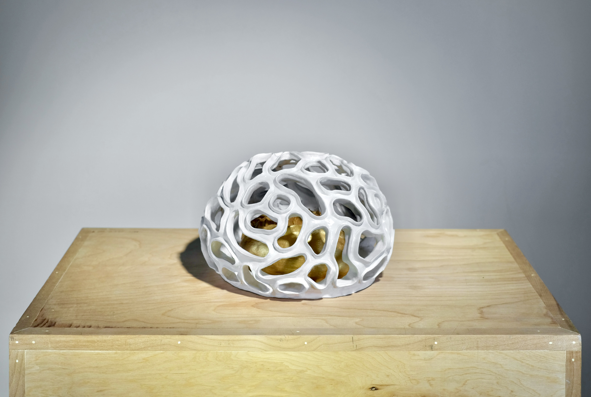
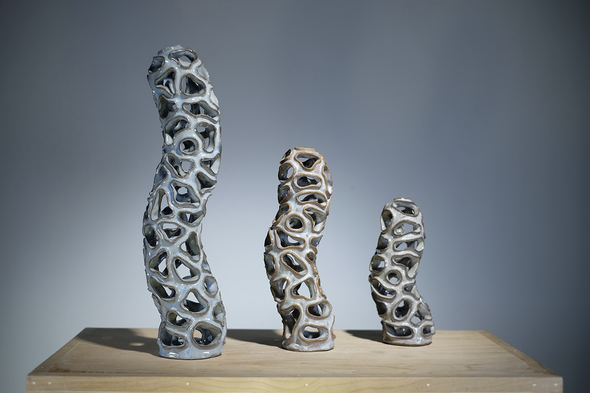

I am interested in reassembling my observations within the context of three-dimensional space for others to see, touch, and experience in a different format. The soft, malleable nature of clay allows me to articulate the curves and nuances that would otherwise be difficult to communicate. Sculptures from the  *Artifact* series build upon my meditations on abstraction from *108*.

