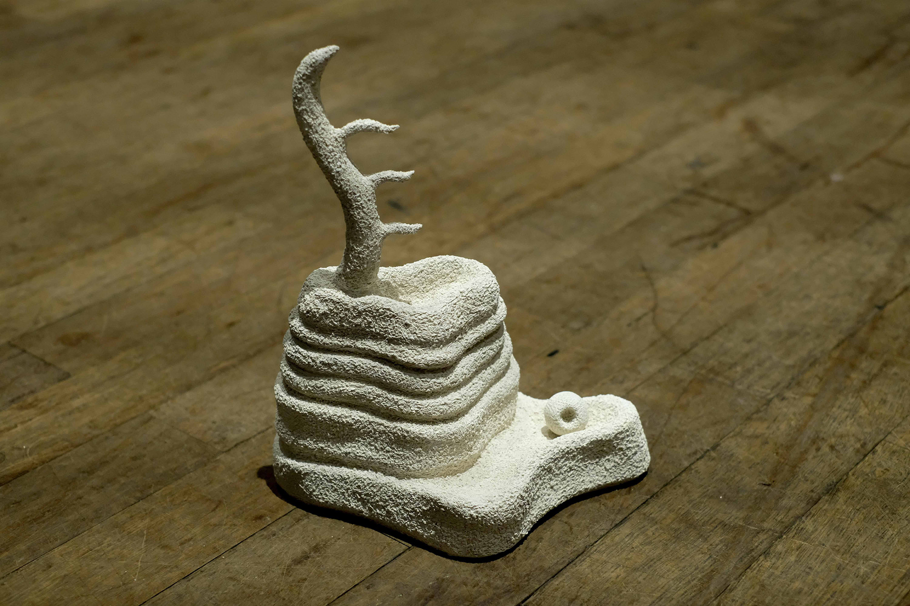
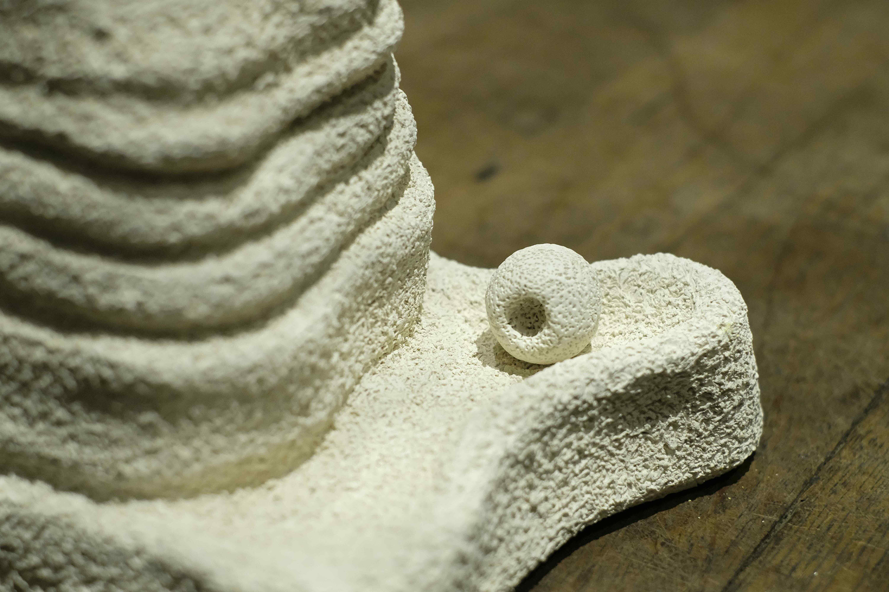
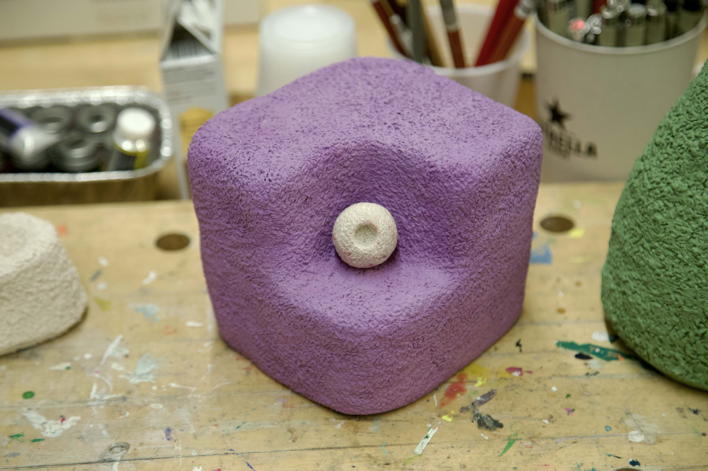
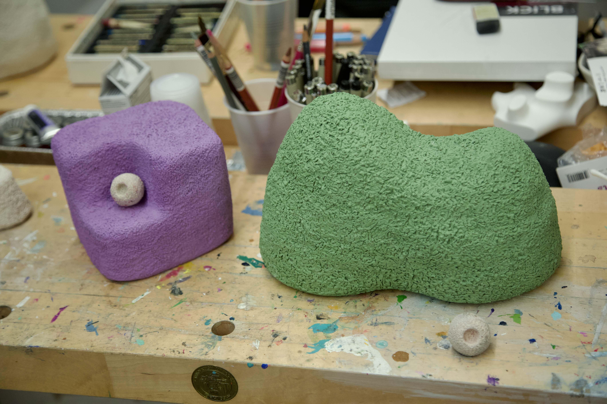
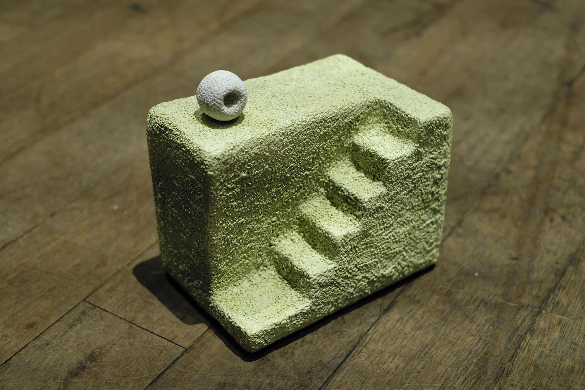
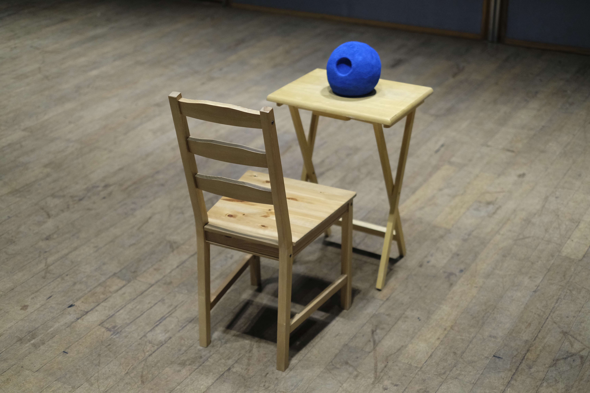

A key component of my works in ceramics is a small handmade ball the size of an avocado seed. Each ball consists of a coarse, bumpy texture resembling that of a [popcorn ceiling](https://en.wikipedia.org/wiki/Popcorn_ceiling) at my dusty apartment in college. I stab the ball with a needle tool across its surface until it is completely filled. 

 The texture is a marker for the presence needed to form the object and a reference to the sensitivities of a living body. What the ball is and holds vary depending on the context in which it is used, as well as the persons involved. Its presence activates larger sculptures that serve as metaphors for my personal experiences in navigating physical and emotional spaces.

