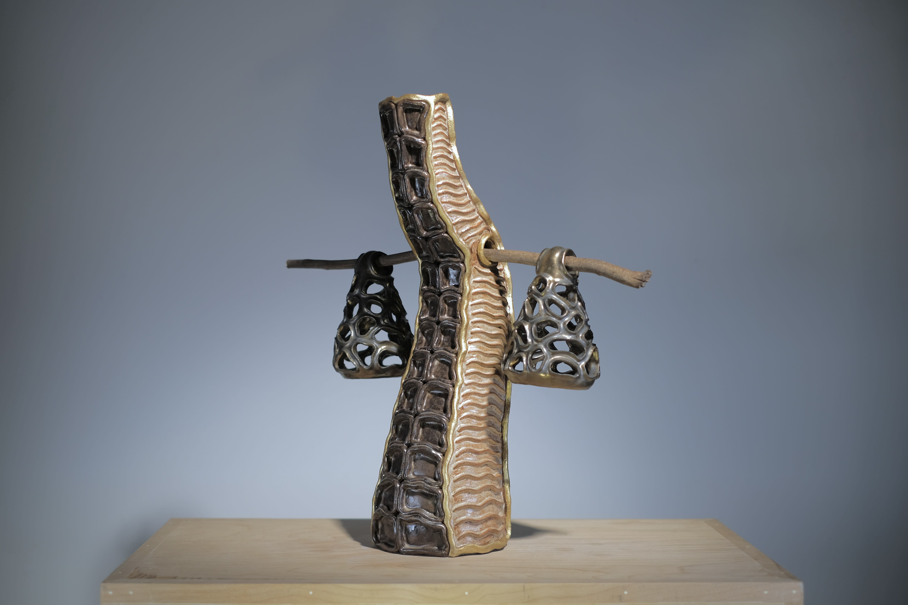
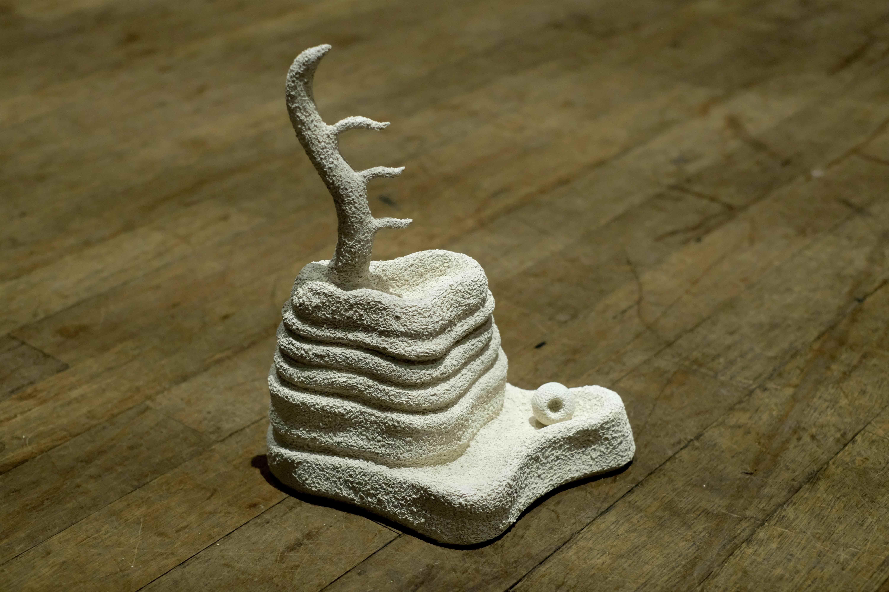
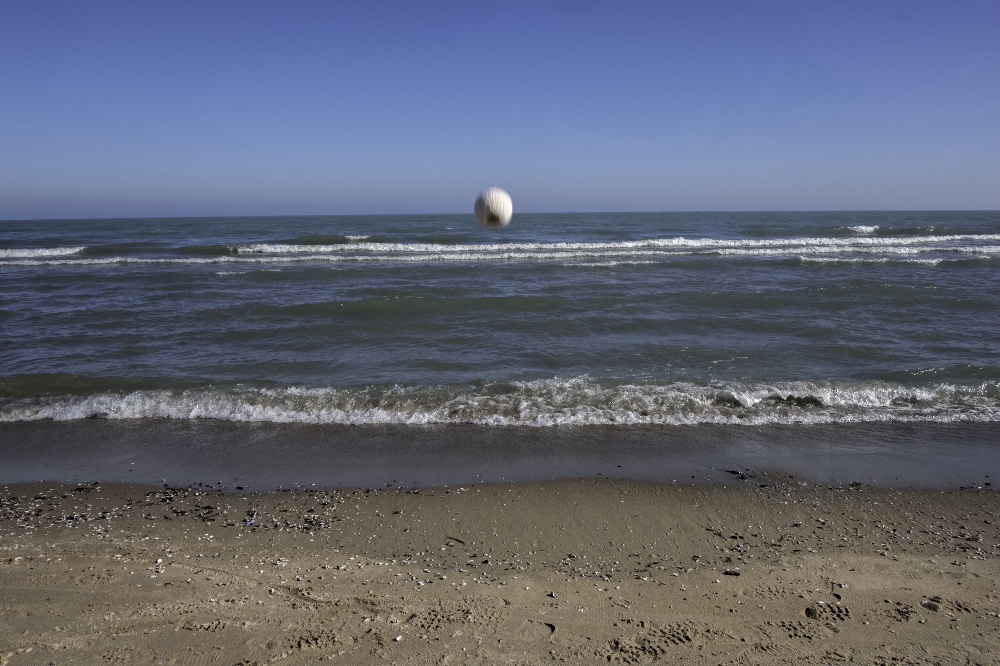

abstract elements of my existence and reassemble them within the context of three-dimensional space for others to see, touch, and experience in a different format. The soft, malleable nature of clay allows me to articulate the curves and nuances that would otherwise be difficult to communicate. 

  

    
    <a href="artifact.md">Artifact</a>
  

  

    
    <a href="habitat.md">Habitat</a>
  

  

    
    <a href="trip.md">Trip</a>
  

