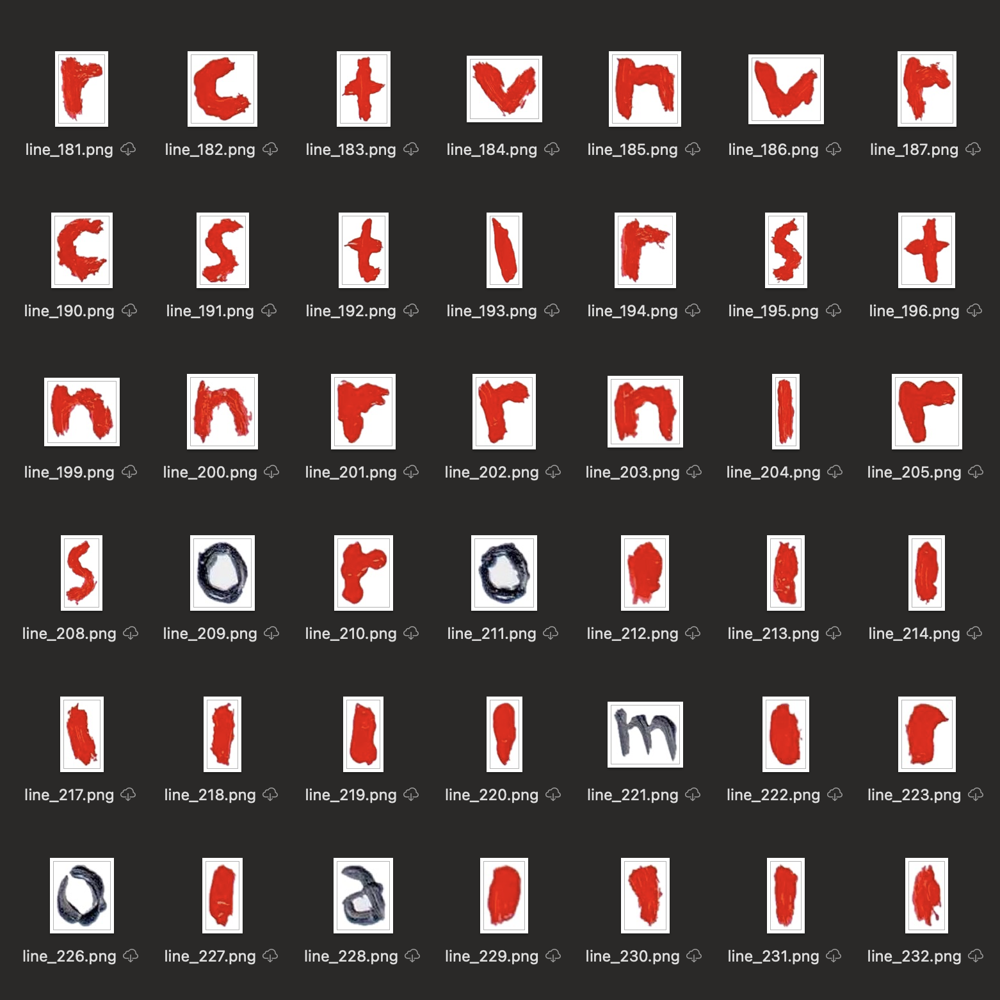
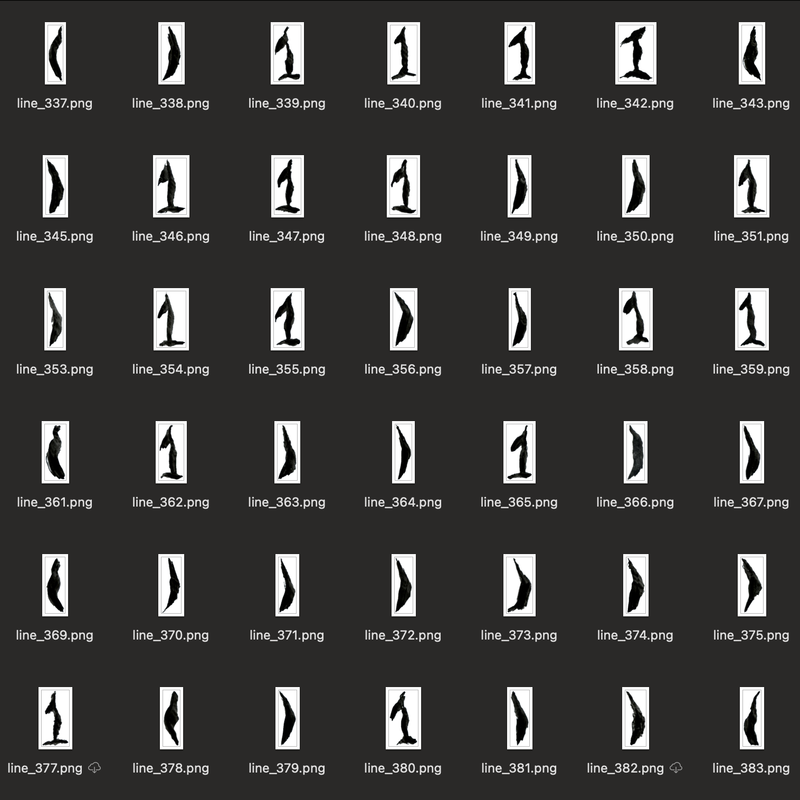

*Hansel* is a generative art program that operates on two stages:

**Asset Extraction**: It analyzes a source image and extracts individual visual elements, converting them into reusable assets.

**Composition Generation**: Using a second input image as a guide, the program arranges the extracted assets to create new compositions that follow the contours and shapes of this second image.

This approach allows for different creative applications, such as the potential to generate sequences of images that could be used for animation or stop-motion-like effects.

 

frames
