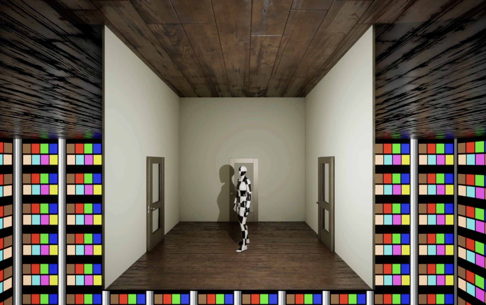
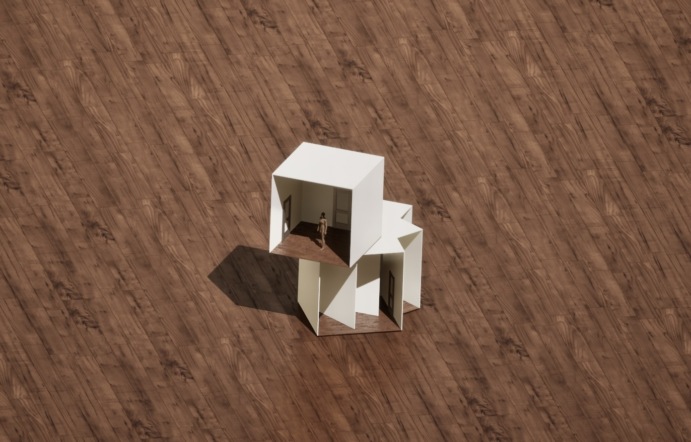

frames

Narcissus is an interactive simulation in which individual decisions manifest real-time as architectural structures. 

As players build rooms and apartments by entering doors and mirrors, their experience is dynamically influenced by mirror interactions,  door alignments, room rotations, and scale transformations. The choices each player makes as they navigate the simulation determine the blueprint of their building, uniquely shaped by the composition of their decisions. 

This work has been developed via Unreal Engine 5 and Blender and is ongoing.

Demo: https://www.youtube.com/watch?v=IyYgfdAIDmA

