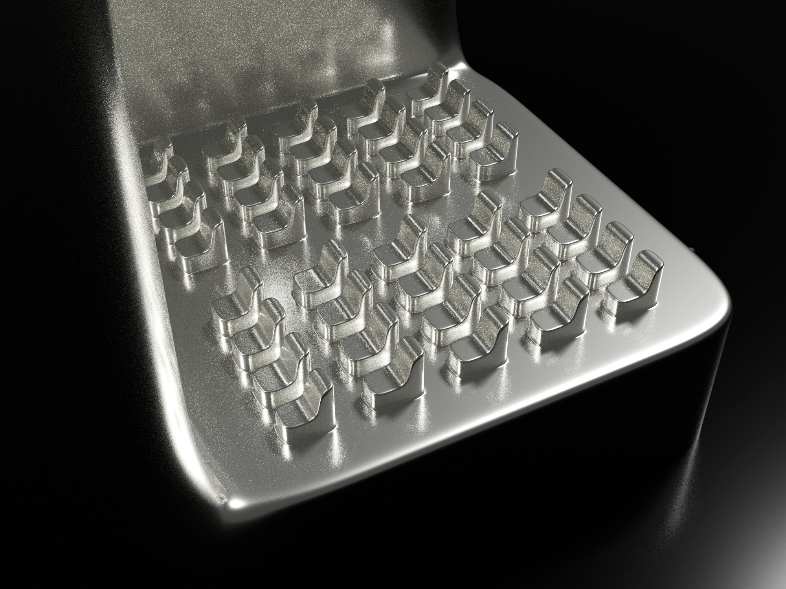

frames

Relic is a virtual object and simulation that combines sites and spaces into a single form. It merges familiar architectural elements (e.g. city skyline, cinema, bathtub, and cave) into one hybrid structure. Once inside the simulation, viewers can navigate and explore these elements firsthand, encountering spaces in unexpected configurations and scales.

Relic is a spatial collage: part ruin, part monument, part imagined environment. It transforms everyday structures into something unfamiliar yet immersive, where scale and function feel both disjointed and cohesive. This work is complete in its design and is being prepared for release on VR and PC platforms.

