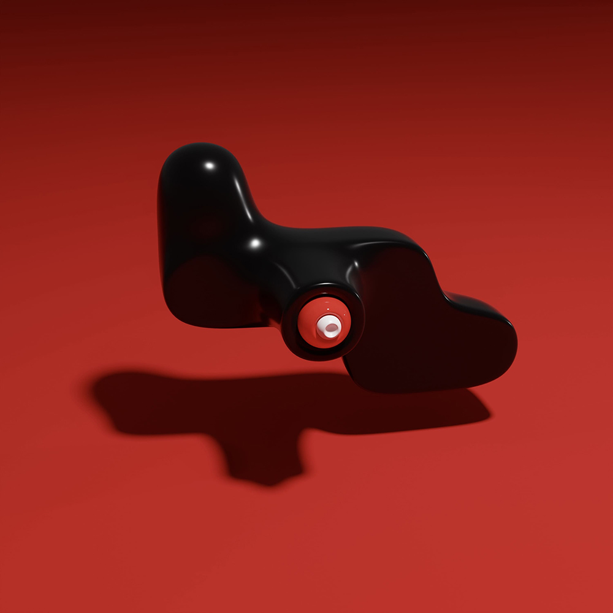

frames

In the deepest depths of the pandemic, I had a dream. It was a utopian vision of a world that was both foreign and home. It was soft, colorful, multidimensional, and dare I say perfect - I had forgotten about the anxieties that I always carry in my body as I walk across the hard-edged, concrete streets of a brutal world, even just for a moment.

As time stretches between me and that initial vision, I find myself paradoxically moving closer to its essence. Through digital sculpting, I tug and pull at my trackpad to produce these components and instruments whose position in time I cannot quite place. Through this method of making, each form becomes increasingly complex, composed of grooves and hinges that appear more realistic with every iteration. 

Some of these forms have been 3D printed in plastic and resin. It is a strange feeling to know objects from my computer screen are pulled into physical existence somewhere in the world - is this how a mother feels, waiting for her child in the incubator? 

