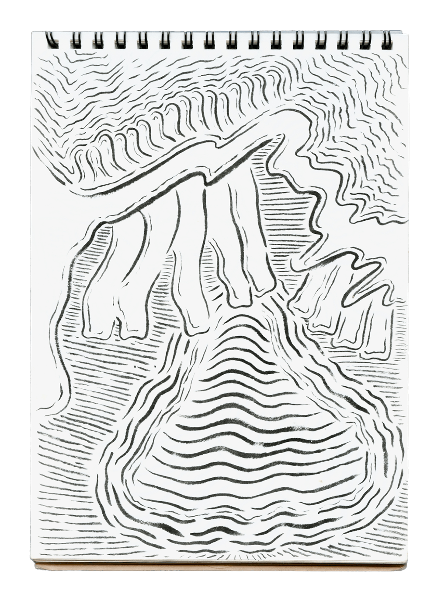
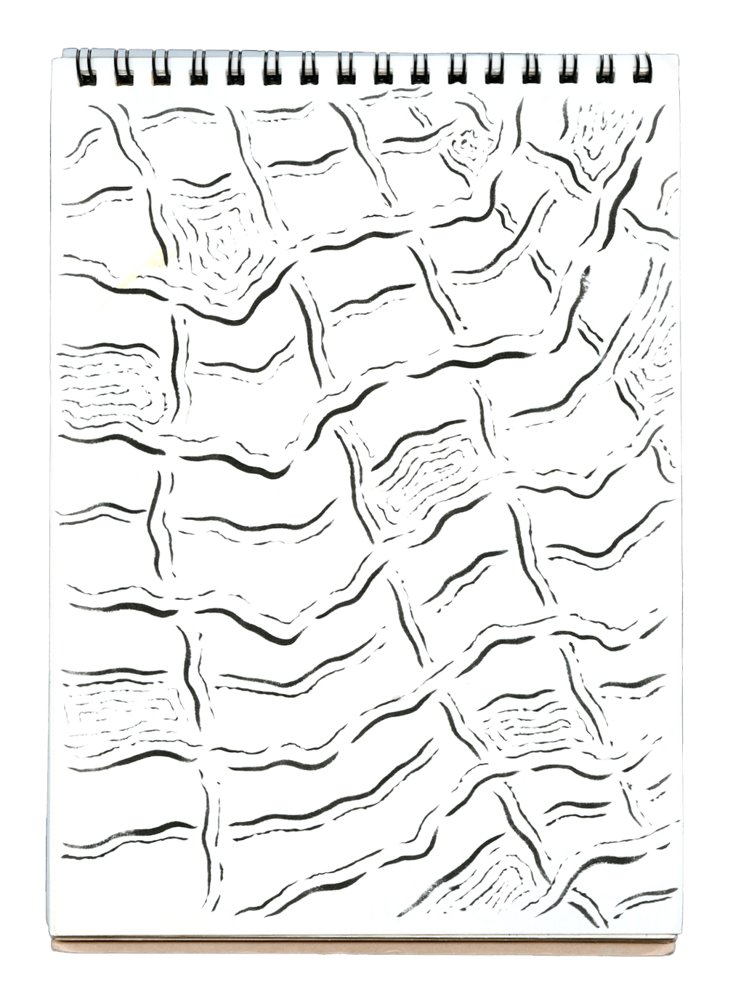
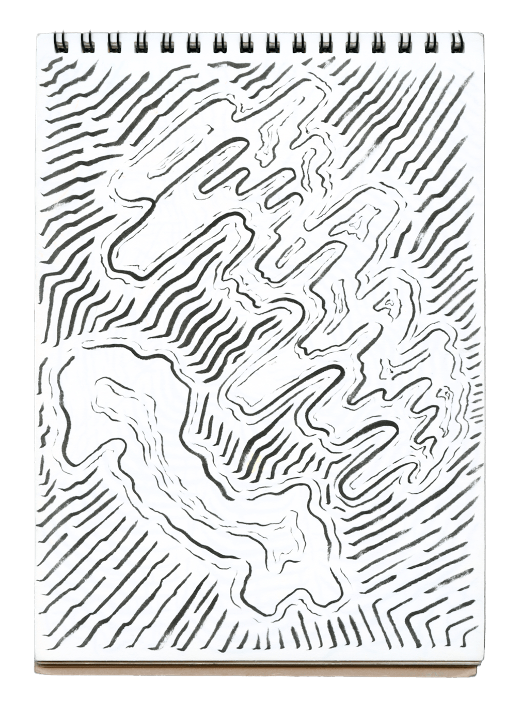

My practice initially began inside a 200-square-feet studio apartment at a dense corporate district in Seoul during the pandemic summer of 2020. Art was a method of survival at a time when I struggled to see a place for myself in this world. 

Drawing was the most conducive medium to working amidst the spatial constraints that I experienced. I began to fill a 6.4” x 8.8” notepad with a brush pen, one line at a time, without an intention to “realize” or “capture” a preconceived image. The composition was determined by the bodily, subconscious impulses for what and where the next line needed to be. 

Initially entirely flat and straight, the lines began to melt, bend, and diversify across the page, accumulating into a set of 108 drawings. Another way to describe it is opening oneself to chance.

