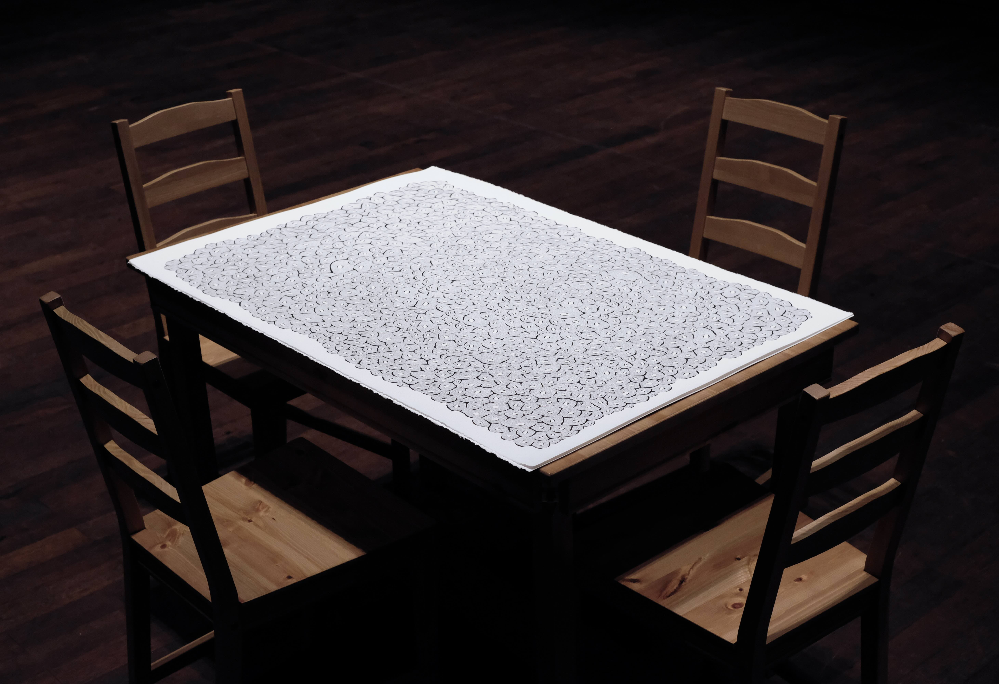
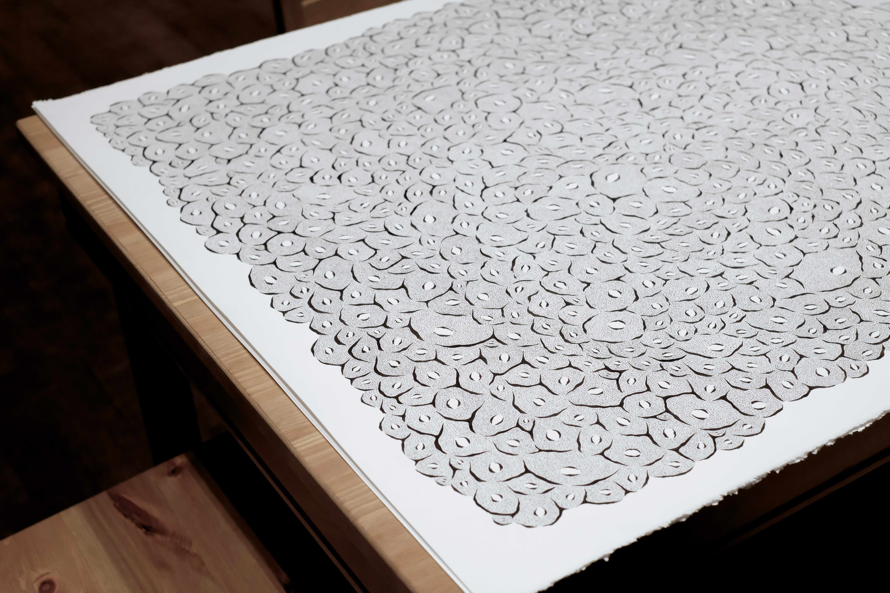
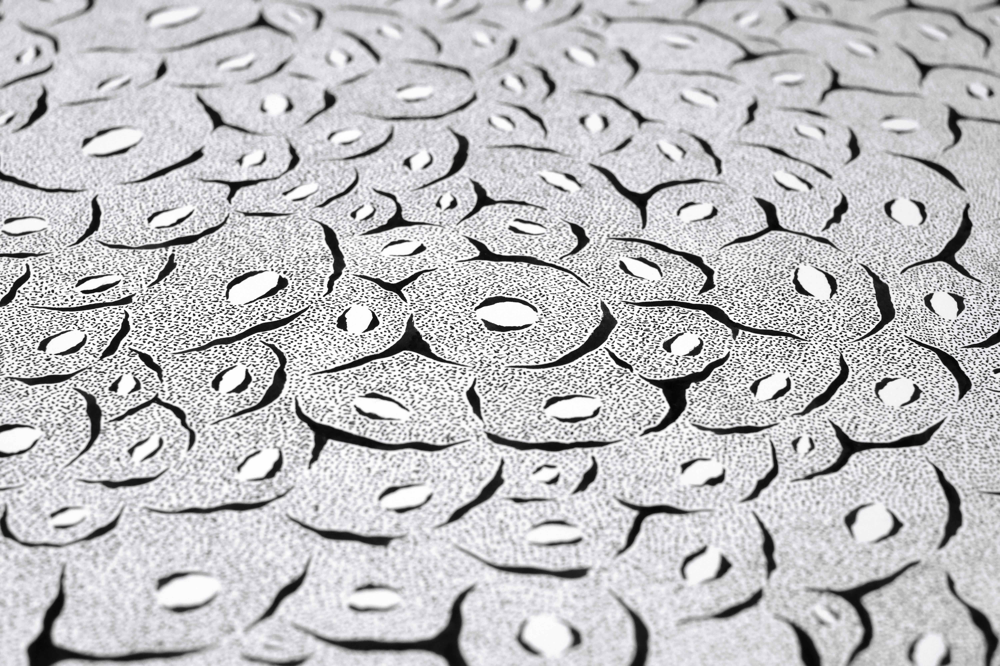

I was paralyzed from experiences that were no longer mine. To free myself from it, I locked myself onto my dining table and a 30” x 43” sheet of paper over the months of July, August, and September.

