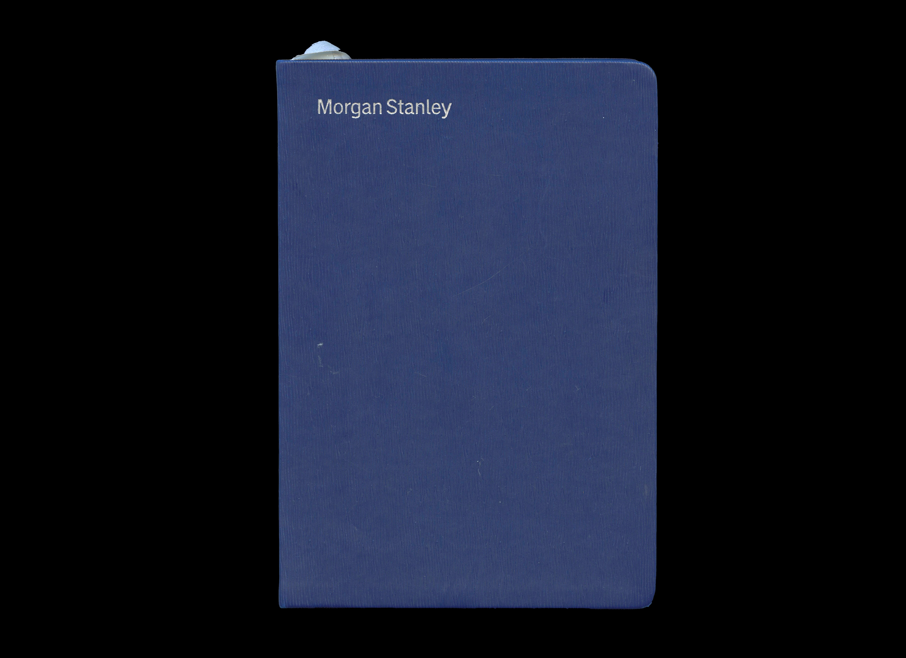
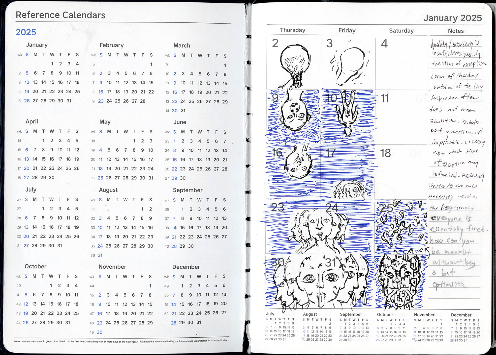
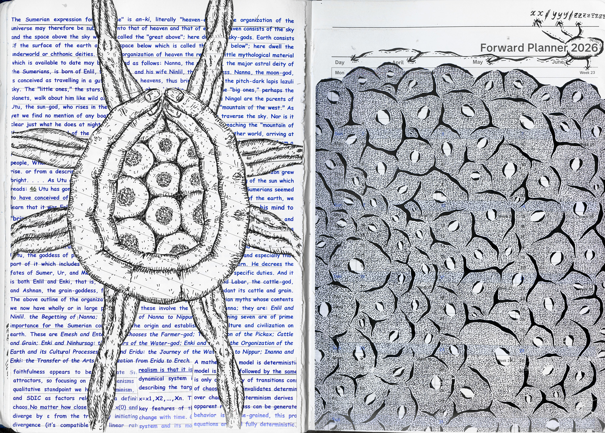
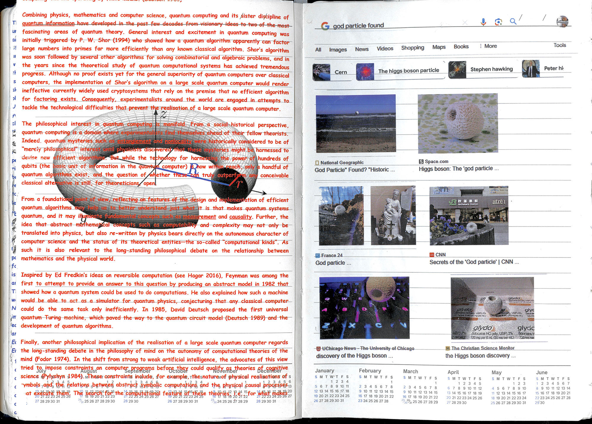

April 15th⁠–May 2nd, 2025

"I am wondering though why you are using a Morgan Stanley planner.

█████████████████████████████████████ ███████████████████████████████████████ ████████████████████████████

Morgan Stanley is one of them.

Does that fact have something to do with your use of the 2025 planner? Are your drawings related to that?

If not, why are you using it?

███████████████████████████████████████ █████████████████████

 I am going to move our $ from CitiCorp.

To which institution I am not sure."

— M.J.B.

https://shanghaiseminary.com/050225/

