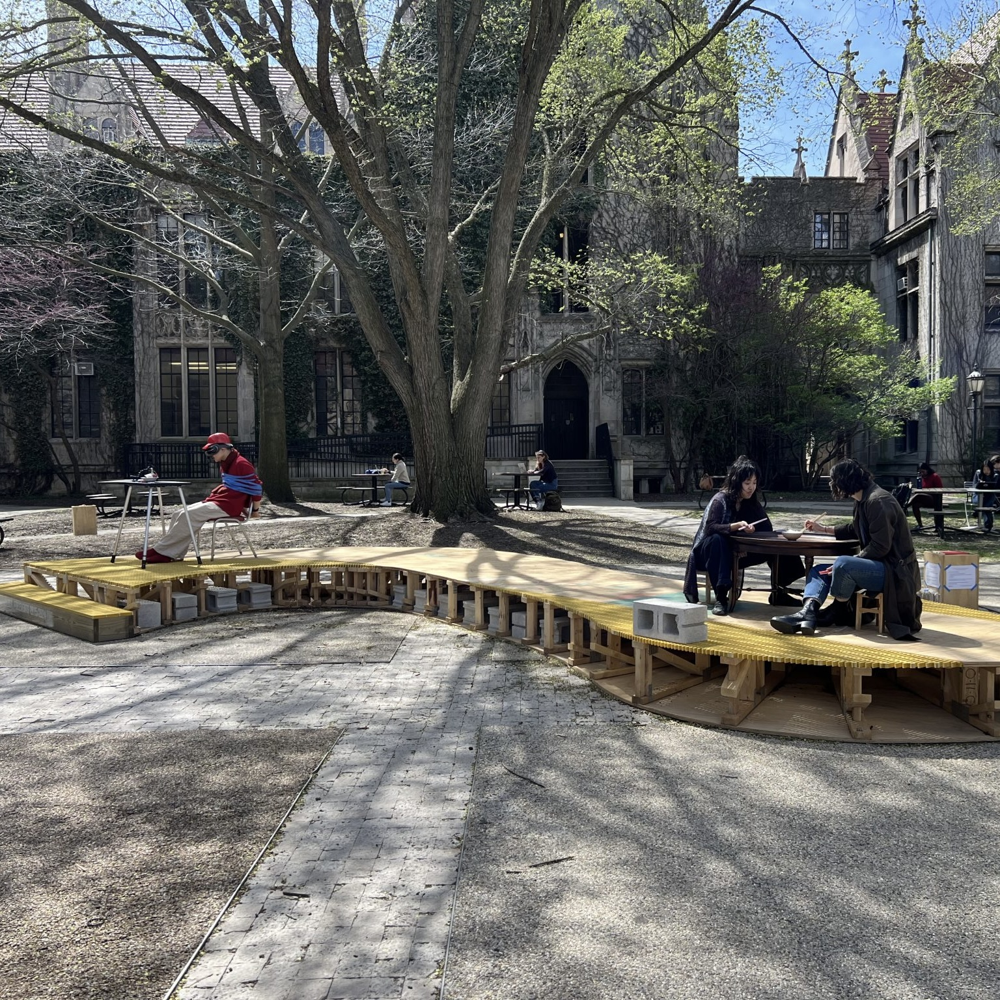
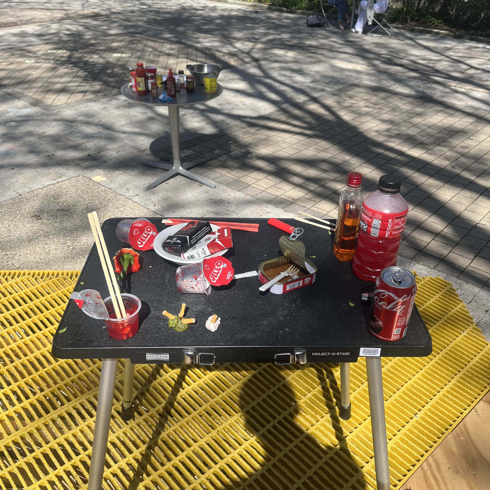
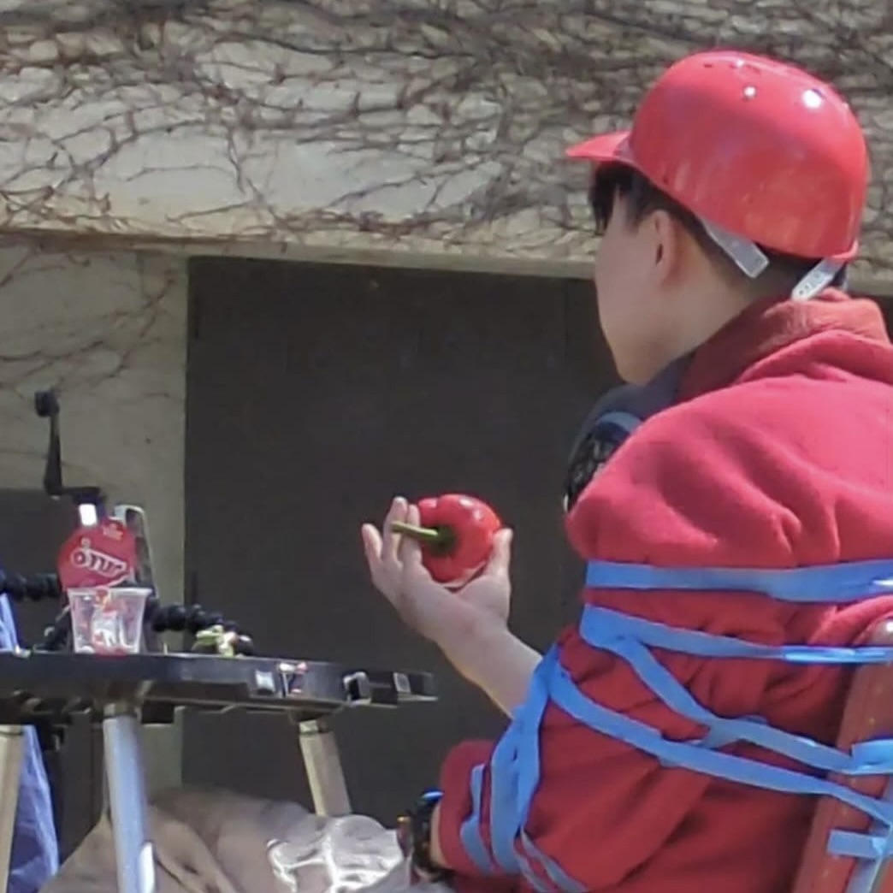
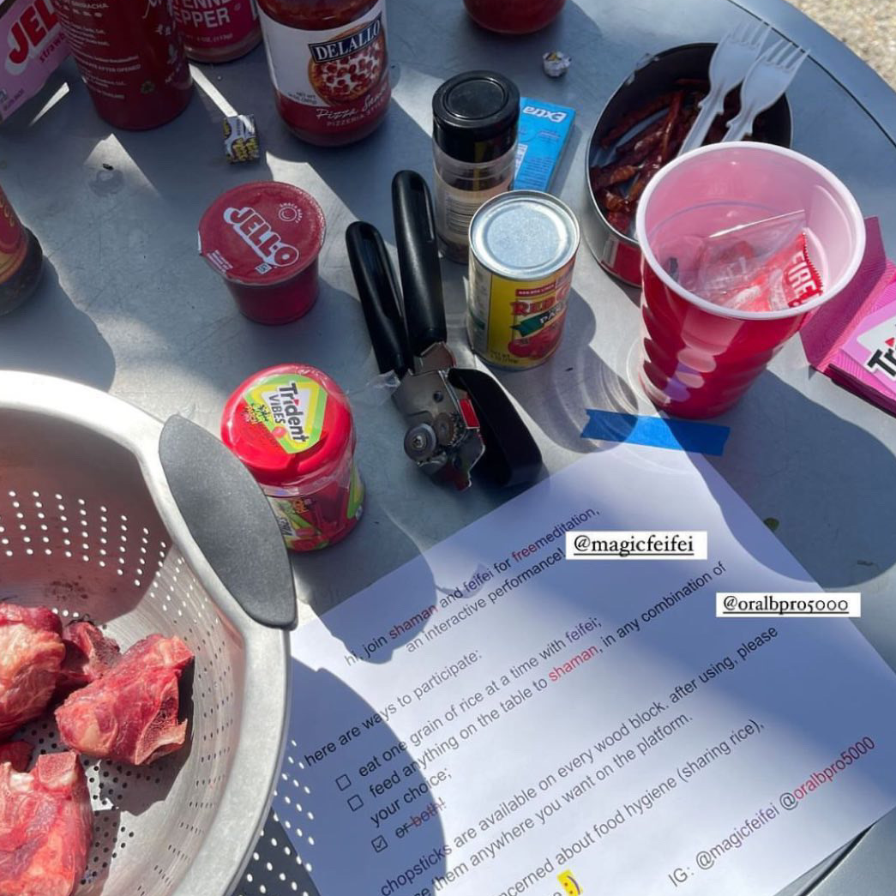

*April 15, 2024*

**Hutchinson Courtyard, University of Chicago, IL**

As part of the programming for *Jessica Stockholder: For Events*, freemeditation was a joint performance with fellow artist feifei. On the platform designed by Jessica Stockholder, two very different styles of interactive performances took place. To quote Nicki Ni's article for New City Art - 

"Their amusing interactive durational performances explored the boundary of intimacy through rule-based interactions. Power dynamics were at play. Each performance demanded an uncomfortable bodily closeness from the participating audience. At one end, feifei laid out a very low dining table and two tiny stools. A bowl of cooked rice was on the otherwise empty table top. feifei sat on one stool and used chopsticks to pick at the rice, eating only one grain at a time... Disposable chopsticks were provided, but you’d better not think too hard about the fact that you were transporting an equal amount of saliva from your mouth to the bowl after the first rice grain. 

[Simon], on the other hand, embraced maximalism. They provided a table full of red items that are—in theory—edible: packaged food such as Jell-O and chewing gum, red condiments including tomato sauces and chili sauces, and raw meat. Participants were invited to feed any items in any combination and amount to the artist, who was seen wearing a red sweater and a VR headset and painter’s-taped to a chair, livestreaming their masked face through a smartphone propped up in front. Also in front of them were two packs of cigarettes. 

Upon the organizers’ approval, I proceeded to “feed” [Simon] an American Spirit under the condition that I held the cigarette. For the duration of this cigarette break, I was this “nondiegetic” hand that occasionally intruded the pictorial frame of their livestream with a cigarette that they puffed at. The artist’s zany red lipstick was transferred to the cigarette butt then to my index finger. For a moment, I became the support system, the prop for a prop, the assist. I didn’t stay for the whole performance, and, to my knowledge, no raw meat was fed. When I circled back, I saw them already emancipated from the painter’s tapes that bound them. When I wondered if they violated their previously self-imposed rules, they said, “I realize I’m free.”

frames