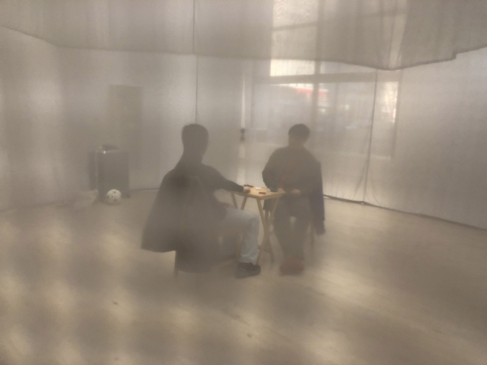

*February 4 + 11, 2024*

**Chicaco Architecture Biennial 5** **(Chicago Cultural Center)**

Throughout the open hours on the last two Sundays of the Chicago Architecture Biennial, I moved my belongings and a foldable table into the Gray Veil (designed by WOJR). I dribbled a UEFA Champions League soccer ball around the site as visitors came by. I offered a performance-for-one to the guests, with each iteration determined by which object they prefer on the table and the invaluable presence of each participant. 

frames