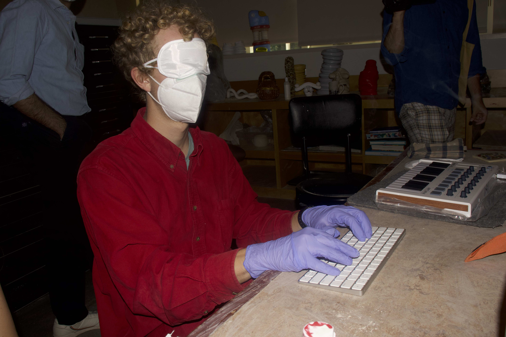

*May 8, 2022*

**Bucksbaum Center for the Arts, Grinnell, Iowa**

Guest performers were given white masks, blindfolds, and nitrile gloves. They were given a verb to perform as the audience entered my studio. Once I pressed a key on the MIDI controller, the performers all stopped what they were doing and stood up. I paired each of them with an audience member (or on one occasion, a fellow blindfolded performer) and danced to a chaotic remix of ballroom music and snippets of memetic sounds from Youtube videos. 

The photos here were also taken by a performer who was blindfolded. 

